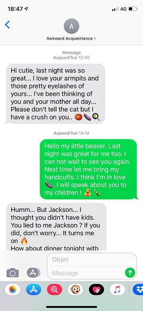
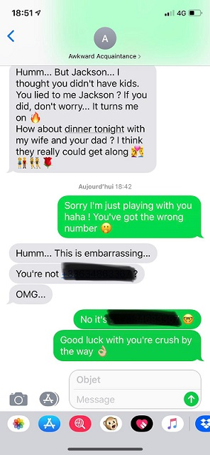
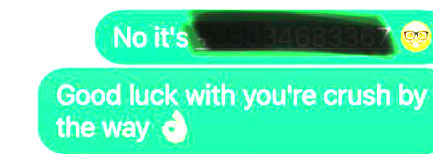

## Call me if you can - Santhacklaus V2

- Catégorie : Misc
- Points : 150
- Description :
```md
You have been contracted to get information on a target.
You need to find his number first.
Everything you need is in the investigation folder. You don't need to go online.
Flags is SANTA{+33XXXXXXXXX}. Just replace the X's with the numbers you'll find. Once you find the number, don't call it, you will unlock another challenger with further instructions.
Investigation File is https://mega.nz/#!LKwlwaaD!qW0c2THAHcKwoM-d7JkjRonkgxI_8D8PCYTfSWdvJkA. MD5 is bd9d36c7f1fa8eca9bc096e9525a5a1c.”
```
Fichier : <a href="https://m0onshadow.github.io/ctf/Santhacklaus/CMIYC/files.zip" download="files.zip" title="Cliquez pour télécharger">files.zip</a> (2 fichiers vidéo supprimés, trop lourds pour Github)
<br/>

* * *

<br/>
<br/>
## Résolution :
<br/>
Première chose à faire : télécharger le dossier d'investigation. Une fois chose faite, observons tout d'abord chaque fichier de chaque dossier.
<br/><br/>
-- Dans `Dropsbox`, rien de très intéressant si ce ne sont des `.pdf` avec quittance de loyer, un `.png` avec un BIC/IBAN et un `.ods` récapitulant les mots de passe de la cible déjà obtenus.... Pas de n° en vue.
<br/><br/>
-- Dans `Keylog et recordings`, un `.m4a` (fichier audio) où l'on peut entendre une conversation téléphonique apparemment accidentelle et un `.txt` avec des keylogs.
<br/><br/>
-- Enfin, un dossier `Social Networks`, contenant lui-même 3 dossiers : `Fakebook`, `Linksin` et `Minigram`. Rien de bien intéressant dans les premiers, et j'ai mis longtemps avant de le comprendre : c'est le dernier dossier qui nous intéresse.
<br/><br/>
Il contient plusieurs images dont deux captures d'écran. La première : <br/><br/>
<br/><br/>
Rien de bien intéressant si ce n'est une conversation plus que suggestive... Passons à la deuxième image.<br/><br/>
<br/><br/>
Oh, mais que vois-je ? Deux portions de message cachées. En zoomant, on aperçoit rapidement un `+3`.
<br/>
<br/>
En ouvrant Gimp et manipulant la saturation et le contraste, le n° apparaît d'une manière relativement claire, et les chiffres manquants n'ont plus qu'à être devinés.<br/><br/>

<br/>
<br/>
Flag : `SANTA{+33634683367}`
<br/>
<br/>
<br/>
