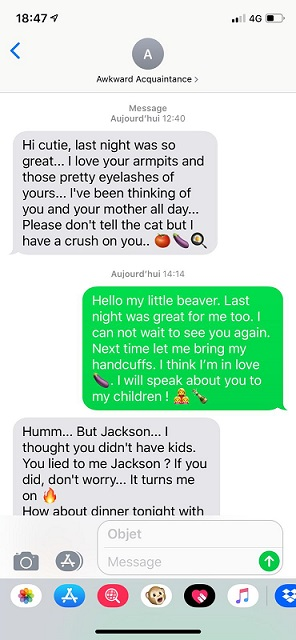
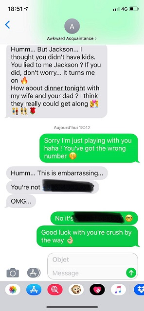
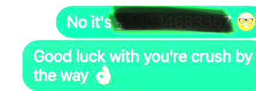

# Call me if you can - Santhacklaus V2

- Category : Misc
- Points : 150
- Description :
```md
You have been contracted to get information on a target.
You need to find his number first.
Everything you need is in the investigation folder. You don't need to go online.
Flags is SANTA{+33XXXXXXXXX}. Just replace the X's with the numbers you'll find. Once you find the number, don't call it, you will unlock another challenger with further instructions.
Investigation File is https://mega.nz/#!LKwlwaaD!qW0c2THAHcKwoM-d7JkjRonkgxI_8D8PCYTfSWdvJkA. MD5 is bd9d36c7f1fa8eca9bc096e9525a5a1c.”
```
File : <a href="https://m0onshadow.github.io/ctf/Santhacklaus/CMIYC/files.zip" download="files.zip" title="Cliquez pour télécharger">files.zip</a> (2 useless video files have been deleted)
<br/>

* * *

<br/>
<br/>
## Resolution :
<br/>
First thing to do : Download investigation file. When it's done, let's take a look to every file in different folders.
<br/><br/>
-- In `Dropsbox`, nothing of really interesting, except some `.pdf` files with rent receipt, a `.png` file with BIC/IBAN and an `.ods` file with password already stolen from our target... No phone number within sight.
<br/><br/>
-- In `Keylog et recordings`, a `.m4a` (audio file) where we can hear a phone conversation seemingly unintended, and a `.txt` file with keylogs.
<br/><br/>
-- Finally, a `Social Networks` folder, containing itself 3 other folders : `Fakebook`, `Linksin` and `Minigram`. Nothing of really interesting in the two first folders, and it took some time for me to understand : it's the last folder which is interesting for us.
<br/><br/>
It contains several pictures, including two screenshots. The first one : <br/><br/>
<br/><br/>
Nothing of really interesting, it's just some kind of "hot" conversation... Let's look at the second one.<br/><br/>
<br/><br/>
Oh, what's here ? Two parts of hidden messages. While enlarging the picture, we can briefly see a `+3`.
<br/>
<br/>
While opening the picture with Gimp and modifying saturation and contrast, the number phone is easily appearing, and missing digits can be guessed.<br/><br/>

<br/>
<br/>
Flag : `SANTA{+33634683367}`
<br/>
<br/>
<br/>
