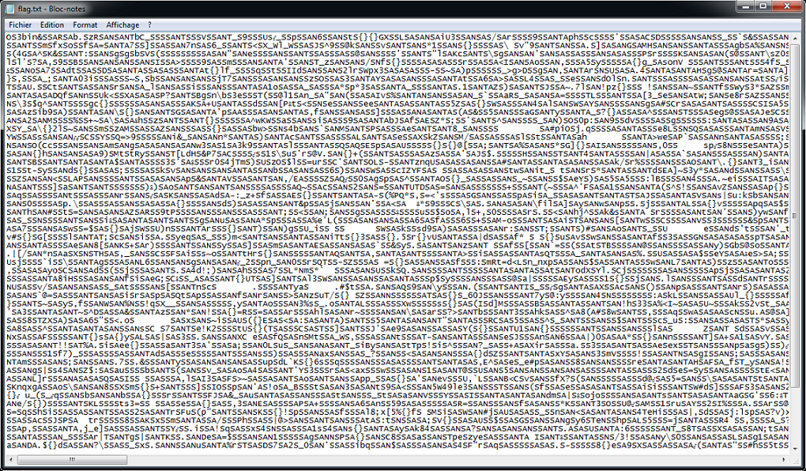
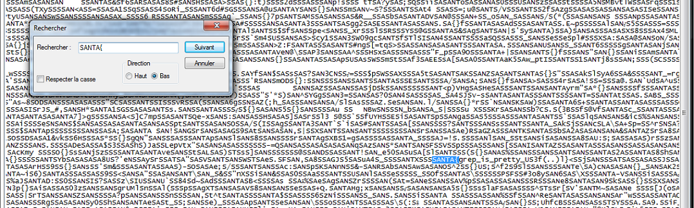

# Grepepe - Santhacklaus V2

- Category : Misc
- Points : 50
- Description :<br/>
```md
Do you know grep ? Regex ? Well you should. It's very useful, especially during CTFs. Remember the flag is something like SANTA{fl4g_f0rmAT}.
MD5 : 6c4299aaa7c7da7250f647e3665fb7a6
```
File : <a href="flag.txt" download="flag.txt" title="Cliquez pour télécharger">flag.txt</a>
<br/>

* * *

<br/>
<br/>
## Resolution :
<br/>
First, we download the `.txt` file. Our very first reflex is opening it : there's this... thing in front of us.<br/>
<br/>
<br/>

<br/>
<br/>
My face when I've seen this :<br/>
<br/>
<br/>
<br/>
<br/>
So, because it's a Windows machine, a `Ctrl + F` should be enough (lazy mode enabled).<br/>
<br/>
<br/>

<br/>
<br/>
Flag : `SANTA{grep_is_pretty_US3f(..)l}`
<br/>
<br/>
<br/>
